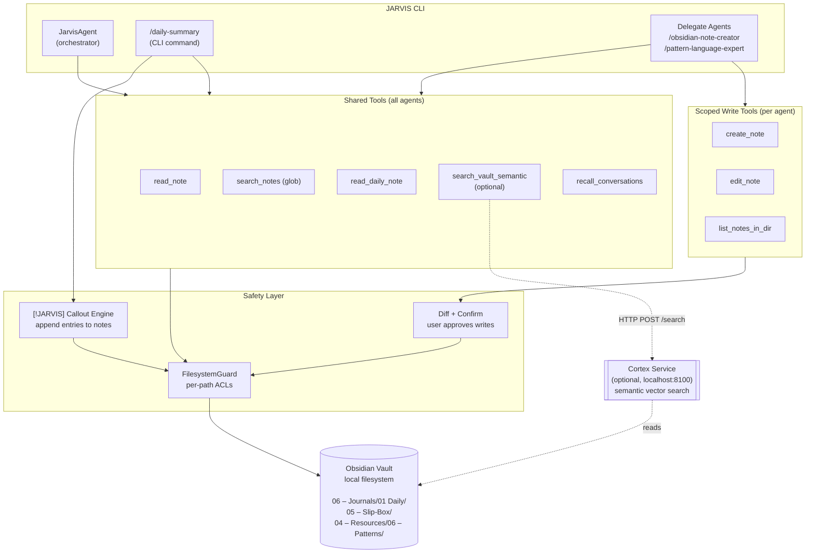

# JARVIS ↔ Obsidian Integration

How JARVIS connects to an Obsidian vault, the tools it exposes to agents, and the safety mechanisms that govern reads and writes.

---

## Architecture Diagram



---

## ASCII Architecture (for terminals)

```
+---------------------------------------------------------------------+
|                            JARVIS CLI                               |
|                                                                     |
|  +----------------+  +-----------------+  +-----------------------+ |
|  | JarvisAgent    |  | /daily-summary  |  | Delegate Agents       | |
|  | (orchestrator) |  | (CLI command)   |  |                       | |
|  |                |  |                 |  | /obsidian-note-creator| |
|  |                |  | Generates daily |  | /pattern-language-... | |
|  |                |  | journal entries |  |                       | |
|  +-------+--------+  +--------+--------+  +-----------+-----------+ |
|          |                    |                       |             |
+----------|--------------------|-----------------------|-------------+
           |                    |                       |
           v                    v                       v
+---------------------------------------------------------------------+
|                          Tool Layer                                 |
|                                                                     |
|  +-- SHARED TOOLS (all agents) ------+  +-- SCOPED TOOLS ---------+ |
|  |                                   |  |    (per agent)          | |
|  |  read_note            read note   |  |                         | |
|  |  search_notes         glob search |  |  create_note   new file | |
|  |  read_daily_note      today's     |  |  edit_note     replace  | |
|  |  search_vault_semantic (optional) |  |  list_notes_in_dir      | |
|  |  recall_conversations             |  |                         | |
|  |                                   |  |  Scoped to:             | |
|  |                                   |  |    slip_box  -> Slip-Box| |
|  |                                   |  |    patterns  -> Patterns| |
|  |                                   |  |    blog_dir  -> (config)| |
|  +-----------------------------------+  +-------------------------+ |
+-----------|----------------|---------------------|------------------+
            |                |                     |
            v                v                     v
+----------------+  +----------------+  +--------------------------+
| FilesystemGuard|  | Diff + Confirm |  | [!JARVIS] Callout Engine |
|                |  |                |  |                          |
| Per-path ACLs: |  | Shows unified  |  | Finds/creates callout    |
|   READ         |  | diff before    |  | blocks in notes; appends |
|   WRITE        |  | any write      |  | entries with timestamps  |
|   READ_WRITE   |  |                |  | and wikilinks            |
|   DENY         |  | User confirms  |  |                          |
|                |  | with y/n       |  | Used by /daily-summary   |
+--------+-------+  +--------+-------+  +-------------+------------+
         |                   |                        |
         v                   v                        v
+---------------------------------------------------------------------+
|                                                                     |
|                Obsidian Vault (local filesystem)                    |
|                                                                     |
|   06 - Journals/01 Daily/         05 - Slip-Box/                    |
|     `-- 2026/2026-04/               `-- Evergreen notes             |
|           `-- 2026-04-14.md                                         |
|               `-- [!JARVIS]       04 - Resources/06 - Patterns/     |
|                    - summary...     `-- Pattern notes               |
|                                                                     |
+---------------------------------------------------------------------+
            ^
            | HTTP POST /search
+-----------+--------------+
| Cortex Service           |
| (optional, localhost)    |
|                          |
| Semantic vector search   |
| over vault content       |
| http://127.0.0.1:8100    |
+--------------------------+
```

---

## Data Flow Summary

- **Reading** — Any agent can read notes, search by filename glob, or query semantically via Cortex.
- **Writing** — Only explicitly authorized agents can write, and only to their scoped directory. Every write shows a diff for user confirmation first.
- **Daily notes** — `/daily-summary` appends to the `> [!JARVIS]` callout block inside the daily note, summarizing conversations as first-person bullet points with `[[wikilinks]]`.
- **Security** — `FilesystemGuard` enforces per-path permissions; no agent can escape its allowed directories.
- **Semantic search** — When the optional Cortex service is running, agents get `search_vault_semantic` for meaning-based vault queries; otherwise they fall back to glob-based `search_notes`.

---

## Components

### Shared Tools (available to all agents)

| Tool | Purpose |
|------|---------|
| `read_note` | Read a markdown note's content (50 KB cap) |
| `search_notes` | List notes matching glob patterns, sorted by name or modification time |
| `read_daily_note` | Read today's or a specified date's daily note |
| `search_vault_semantic` | Meaning-based search via Cortex API (optional) |
| `recall_conversations` | Semantic search across past JARVIS conversations |

### Scoped Write Tools (per agent, declared in `meta.yaml`)

| Tool | Purpose |
|------|---------|
| `create_note` | Create a new note, optionally prepending a template |
| `edit_note` | Replace full note content (with diff confirmation) |
| `list_notes_in_dir` | List notes within the agent's scoped directory |

Currently authorized writers:

- **`obsidian_note_creator`** (`/obsidian-note-creator`) — writes evergreen atomic notes to the **Slip-Box**.
- **`pattern_language_expert`** (`/pattern-language-expert`) — writes pattern notes to the **Patterns** folder.

### Configuration

All Obsidian settings live in `config/local.yaml`:

```yaml
obsidian:
  enabled: true
  vault_path: "/path/to/vault"
  daily_notes:
    path_format: "06 – Journals/01 Daily/%Y/%Y-%m/%Y-%m-%d"
  writing:
    slip_box:
      target_dir: "05 – Slip-Box"
      template_path: "99 – Meta/00 – Templates/(TEMPLATE) Permanent Note"
    patterns:
      target_dir: "04 – Resources/06 – Patterns"

cortex:
  enabled: true
  base_url: "http://127.0.0.1:8100"
  timeout_seconds: 10
```

### Source Layout

| Path | Role |
|------|------|
| `packages/integrations/obsidian/vault.py` | Vault config, path validation, read helpers |
| `packages/integrations/obsidian/writer.py` | Write coordinator with diff confirmation |
| `packages/integrations/obsidian/callout.py` | `> [!JARVIS]` callout block parsing/appending |
| `packages/integrations/obsidian/diff.py` | Unified diff computation and formatting |
| `packages/core/tools/vault_read_tools.py` | Shared read tools factory |
| `packages/core/tools/vault_write_tools.py` | Scoped write tools factory |
| `packages/core/tools/cortex_search.py` | Semantic search tool (Cortex client wrapper) |
| `packages/core/filesystem_access.py` | `FilesystemGuard` per-path ACL enforcement |
